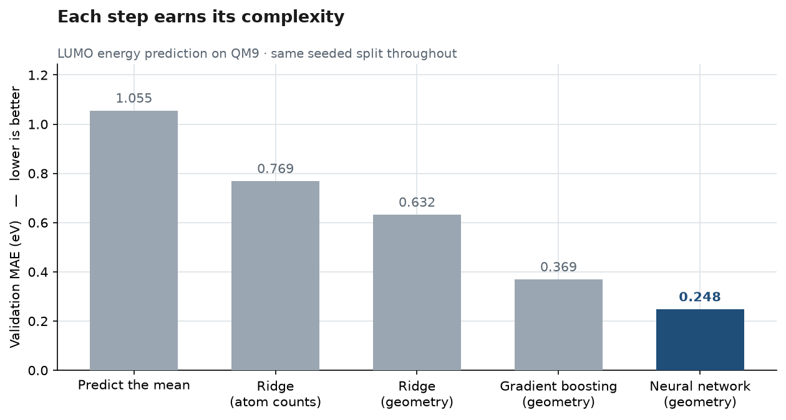
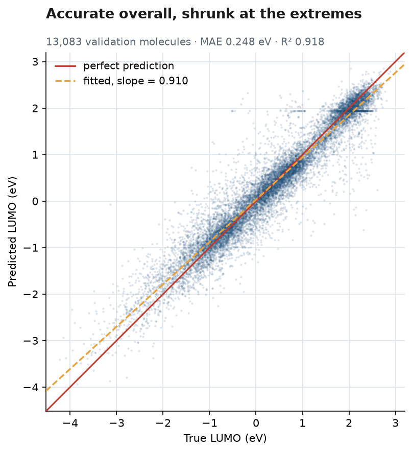

# Molecular Property Predictor

Predicting a physical property of a molecule — the energy of its lowest empty electron orbital — directly from its 3D structure, in a fraction of a second instead of an hours-long quantum chemistry calculation.

This repository is meant to be **read**. It is a complete, honest walk from raw scientific data to a trained model wrapped in a working API, with every decision written down, including the ones that did not work. If you want to do something similar for your own problem, the [adapt it](#adapt-it-to-your-own-problem) section is the shortest path.

You do **not** need a machine learning or chemistry background to follow this README.



---

## What this project actually does

1. It takes a public dataset of about 134,000 small molecules, each with properties originally computed with expensive quantum chemistry software.
2. It turns each molecule's 3D structure into a fixed list of numbers a model can work with.
3. It trains a model to learn the relationship between those numbers and one property.
4. It serves the trained model through a small web API, so a script or another program can send a molecule and get a prediction back.

This mirrors a real pattern in drug discovery and materials science: exact simulations are slow, so a trained model screens thousands of candidates cheaply and only the promising ones get the expensive calculation.

> **One caveat, stated up front rather than buried.** "Send it a molecule" means sending 3D atomic coordinates, and the model expects the *relaxed* geometry that the original quantum chemistry calculation produced. So this replaces the property calculation, not the geometry optimisation that comes before it. Feeding it a rough geometry will make the prediction worse, and nothing in the response will warn you. The speed-up is real, but it is a speed-up of one step, not of the whole pipeline.

## The dataset in plain terms

**QM9** is a well-known public dataset in computational chemistry: around 134,000 small organic molecules (up to nine heavy atoms — carbon, nitrogen, oxygen, fluorine), each with physical properties calculated by quantum chemistry simulation. Those simulations are accurate but slow. This project trains a model to approximate one of those properties almost instantly.

The property predicted here is the **LUMO energy**. That choice was made on evidence, not convention, and the reasoning is worth knowing before you pick a target for your own work — see [choosing a target](#1-choose-a-target-that-cannot-be-faked).

## The moving parts, without jargon

| Piece | What it's for, in plain terms |
|---|---|
| **Feature extraction** | Turning a molecule's structure into a list of numbers. Models can't read a chemical structure directly — it has to be translated into a consistent numerical format first. |
| **Baseline models (scikit-learn)** | Simple, fast models fitted *before* the neural network, so there is something to beat. Without a baseline, "92% variance explained" is a number with no meaning attached. |
| **Model (PyTorch)** | The part that learns the pattern between "numbers describing a molecule" and "the property." A very flexible curve-fitting function that adjusts itself as it sees more examples. |
| **Experiment tracking (MLflow)** | A logbook for every training attempt — settings used, accuracy reached. Without it you lose track of which version actually worked best after a few dozen attempts. |
| **API (FastAPI)** | A small web service: send it a molecule, get a prediction back, in a format any program can consume. |
| **Container (Docker)** | The code, the trained model, and everything they need packaged into one unit that behaves identically on any machine. Not required to use this project — Python alone is enough. It matters when software has to run unattended on a server nobody curates by hand, which is the situation containers were invented for. |

## Architecture, top to bottom

```
QM9 dataset  (134k molecules, 3D coordinates + computed properties)
    │
    ▼
Feature extraction  (molecule → 435 numbers, invariant to rotation/translation/atom order)
    │
    ▼
Baseline models  (scikit-learn — the bar the network has to clear)
    │
    ▼
Model training  (PyTorch, tracked with MLflow)
    │
    ▼
Trained artifact  (weights + scaler + provenance, in one file)
    │
    ▼
FastAPI service loads the artifact
    │
    ▼
Docker container packages the whole thing
    │
    ▼
Send a molecule → get a prediction
```

## How well does it work?

Errors are in electronvolts (eV). For scale, the property spans roughly −4.8 to +5.3 eV across the dataset, and always guessing the average would be wrong by 1.05 eV.

| Model | Error (MAE) | Variance explained (R²) |
|---|---|---|
| Always guess the average | 1.055 eV | 0.00 |
| Ridge regression on atom counts | 0.769 eV | 0.46 |
| Ridge regression on geometry | 0.632 eV | 0.63 |
| Gradient boosting on geometry | 0.369 eV | 0.86 |
| **Neural network (this project)** | **0.248 eV** | **0.92** |

All rows are scored on the same *validation* set, so they are directly comparable — that set is what every modelling choice in the project was made against.

The final model was then scored **once** on a test set it had never touched, and which no decision was ever based on: **0.244 eV**, R² 0.922. That is the honest estimate of performance on unseen molecules, and its closeness to the validation figure indicates the choices made along the way were not overfitted to the validation set.

### Where it falls short



That figure is the honest one. The points hug the diagonal — but the fitted line (orange) is flatter than perfect prediction (red): **slope 0.910 instead of 1.0**. The model pulls its predictions toward the average, under-predicting the high end and over-predicting the low end. In a screening application the unusual molecules are the interesting ones, and they are exactly where this model is least reliable.

Three further limitations, stated plainly:

- **Published models reach roughly 0.02–0.04 eV**, about ten times better. They use graph neural networks that *learn* how to represent a molecule, instead of being handed a fixed 2012-era recipe as here. A bigger version of this network would not close that gap.
- **The train/test split is random**, so most test molecules have close relatives in training. Performance on a genuinely novel class of molecule would be worse. A scaffold split would be stricter and less flattering.
- **No uncertainty per prediction.** What exists is a population-level error, not an error bar on any individual answer.

## Read this repo in five minutes

If you only open three files, open `features.py`, `train.py`, and `notebooks/03_baseline.ipynb`.

**The code** (`src/molecular_property_predictor/`):

| Module | What it does | Worth reading for |
|---|---|---|
| `data.py` | Downloads and parses QM9 from the original archive; splits it | Why the split is seeded, and why a random split is optimistic |
| `features.py` | Three ways to turn a molecule into numbers | Why the encoding must not change under rotation, translation, or atom renumbering |
| `baseline.py` | scikit-learn models, fitted before any neural network | Why the scaler lives inside the Pipeline (leakage) |
| `model.py` | The network, and the artifact format | Why weights and scaler are saved *together*, and why the scaler is stored as arrays rather than pickled |
| `train.py` | The training loop, written out by hand | The five steps: forward, loss, zero_grad, backward, step |
| `tracking.py` | MLflow runs and sweeps | Why the loop takes a callback instead of importing MLflow |
| `api/` | `schemas.py` (contract) → `service.py` (prediction) → `main.py` (HTTP) | Why the three are separate, and why endpoints are `def` and not `async def` |

**The notebooks** (`notebooks/`) — each is the executed analysis for one phase, with outputs saved, so they read on GitHub without running anything:

| Notebook | The question it answers |
|---|---|
| `01_explore_qm9` | Which property is worth predicting? (Some targets can be predicted with no chemistry at all) |
| `02_features` | What does each representation keep and throw away? Includes the discontinuity the sorted Coulomb matrix introduces |
| `03_baseline` | Does geometry actually beat atom counts? Does the complexity pay? |
| `04_pytorch` | Does a neural network beat gradient boosting — and does the loss function matter? (A negative result) |
| `05_mlflow` | What does hyperparameter tuning actually buy? (2.6%) |
| `05b_convergence` | Was a claim in Phase 5 wrong? (Yes — it is corrected here rather than quietly fixed) |
| `06_api` | Does the served model behave, and why is the methane example so far off? |

**The commit history** is one commit per phase, each with a long message explaining what was decided and why. `git log` is a readable document in this repo, not a changelog.

## Run it

Plain Python. Nothing else is required — no Docker, and no dataset download to serve predictions, since the trained model is committed.

```bash
git clone https://github.com/rahulj98/Molprop_predict
cd Molprop_predict

pip install -e ".[dev]"

# Point the service at the trained checkpoint and start it
export MODEL_PATH=models/served.pt      # Windows: set MODEL_PATH=models\served.pt
uvicorn molecular_property_predictor.api.main:app --reload
```

The service is then at `http://localhost:8000`. Interactive documentation is generated automatically at `/docs`, and `GET /model` reports exactly which checkpoint is loaded and how accurate it measured.

This is the route to take if you want to **work with** the code — read it, change it, retrain it. Everything in [adapt it](#adapt-it-to-your-own-problem) assumes you are here.

<details>
<summary>Or run the container, if you just want an answer</summary>

Useful if you would rather not install Python 3.12, or if you are on Linux where a plain `pip install torch` pulls ~2.5 GB of CUDA libraries you may not want (the Dockerfile installs the CPU build instead).

```bash
docker build -t molecular-property-predictor .
docker run --rm -p 8000:8000 molecular-property-predictor
```

Same endpoints, same port, and `docker ps` reports `healthy` once the model has loaded. What you cannot do from inside the container is change anything — it serves the model, it does not let you work on it.

</details>

Then send it methane:

```bash
curl -X POST http://localhost:8000/predict \
  -H "Content-Type: application/json" \
  -d '{
        "atomic_numbers": [6, 1, 1, 1, 1],
        "coordinates": [
          [-0.0127,  1.0858,  0.0080],
          [ 0.0022, -0.0060,  0.0020],
          [ 1.0117,  1.4638,  0.0003],
          [-0.5408,  1.4475, -0.8766],
          [-0.5238,  1.4379,  0.9064]
        ]
      }'
```

```json
{"lumo_ev":2.003439426422119,"units":"eV","n_atoms":5}
```

The reference value for methane is +3.19 eV. That is an unusually large error and it is kept here deliberately: methane sits at the 100th percentile of the dataset's range, exactly where the shrinkage shown in the figure above is worst. `notebooks/06_api.ipynb` works through it, and shows eight randomly drawn molecules averaging 0.19 eV for comparison.

**Tests:** `pytest` runs 269 tests, of which 261 need nothing but the installed package. Three more (`-m dataset`) check that both packages agree on the dataset and its splits, and need QM9 on disk. Five (`-m docker`) exercise the built container image — that the checkpoint is really inside it, that a prediction survives a real socket, that the process is not running as root. Both groups skip cleanly rather than failing when what they need is absent.

## Reproduce it from scratch

Everything below regenerates from code plus recorded random seeds. Measured on a laptop CPU (no GPU anywhere in this project):

| Step | How | Time | Produces |
|---|---|---|---|
| Install | `pip install -e ".[dev]"` | ~1 min | |
| Download + parse QM9 | first call to `load_qm9()`, or run notebook 01 | 82 MB download, then a couple of minutes to parse 134k files | `data/processed/qm9.parquet` (93 MB) |
| Featurise | `load_features(frame)`, or notebook 02 | 8 s | `features_sorted_coulomb.npz` (22 MB) |
| Baselines | notebook 03 | ~6 min (ridge on 435 features dominates) | `baseline_results_seed0.csv` |
| Train the network | notebook 04 | ~7 min | a checkpoint in `models/` |
| Hyperparameter sweep | notebook 05 | ~57 min for nine runs | MLflow runs in `mlruns/` |
| Convergence re-run | notebook 05b | ~46 min | four more runs |
| Figures in this README | `python scripts/make_figures.py` | ~30 s | `docs/figures/*.png` |
| Build the container | `docker build -t molecular-property-predictor .` | 105 s from scratch, seconds when cached | a 2.09 GB image |

The served checkpoint (`models/served.pt`, learning rate 1e-3, hidden layers 1024-512-256) took **15 minutes** to train.

`models/` is gitignored — trained artifacts are build outputs — with one deliberate exception: `models/served.pt` is committed, at 4.2 MB, so that `docker build` works from a fresh clone. Every other checkpoint comes from running the notebooks.

<details>
<summary>Why the Docker image is 2.09 GB</summary>

Large for a web service, and worth explaining rather than hiding. PyTorch alone is 750 MB of it; the scientific Python stack underneath (SciPy, pandas, PyArrow, scikit-learn, NumPy) is another 450 MB. The Dockerfile already takes the biggest saving available — installing the CPU-only build of PyTorch rather than the default, which would pull ~2.5 GB of CUDA libraries onto a machine with no GPU. The rest is essentially the cost of shipping PyTorch.

Note that disk size and memory are different questions: the running container was measured at **373 MB** of resident memory serving predictions, and 386 MB under a 200-molecule batch. Getting the *image* substantially smaller would mean exporting to a lighter inference runtime such as ONNX Runtime — a real option, and a different project.

</details>

## Adapt it to your own problem

The parts worth copying are mostly the discipline, not the code. In rough order of transferability:

### 1. Choose a target that cannot be faked

Before predicting anything, check whether a model containing *no* domain knowledge already does well. In this project, least squares on plain atom counts reaches R² = 1.0000 on four of QM9's targets and 0.9971 on a fifth — those are extensive properties that scale with molecule size, so a "model" that has learned nothing at all looks superb. The same check gives 0.4555 on LUMO, which is why LUMO was chosen: it leaves real structural signal to earn.

Notebook 01 does this check in about twenty lines. It is the highest-value hour in the whole project.

### 2. Change the target property

QM9 ships 15 properties, all parsed into the dataframe. Swapping the target is a one-line change wherever `target="lumo"` appears (`train.py`, the notebooks). Bear in mind the check above first: `homo`, `gap`, `mu`, `alpha` and `zpve` behave very differently under it.

### 3. Bring your own dataset

Replace `data.py`. Everything downstream depends on a dataframe with two columns — `atomic_numbers` and `coordinates` — plus a target column. If your structures come from somewhere else, produce those columns and the rest of the pipeline is unchanged.

### 4. Reuse the artifact pattern

`model.save_artifact` writes weights, the fitted scaler, and provenance (both seeds, the representation, the measured error) into one file. This is the single most portable idea here: a model saved without the preprocessing it was trained under returns *plausible* nonsense when served, and nothing raises. The API refuses to start if the artifact's recorded feature width disagrees with its weights.

### 5. Keep the test set sealed

Every score in phases 3 through 5b is a validation score, because each one informed a decision. A split used to make choices can no longer estimate performance on unseen data. The test set was opened once, after the model was frozen, and never again.

## What I'd do next

Honest next steps, roughly by expected value:

- **A graph neural network.** The largest remaining gap is the representation, not the model. A message-passing network that learns the encoding is how published work reaches 0.02–0.04 eV, and it would make this fixed descriptor obsolete.
- **A scaffold split**, to get an honest number for genuinely novel chemistry rather than interpolation within a chemical space.
- **Uncertainty estimates** — an ensemble or a quantile head — so a prediction near the edge of the distribution can say so, which the shrinkage figure shows it needs.
- **ONNX export**, which would shrink the container by roughly an order of magnitude and make deployment on a constrained host straightforward.

## Project status

**Part I is complete**, tagged `v1.0.0`: data, features, baselines, neural network, experiment tracking, API, container. Each phase is a separate commit, so the build process itself is visible rather than only its result.

**Part II is in progress** — a graph neural network, in `src/molecular_gnn/`. Everything above hands the model a *fixed* description of a molecule; the question now is whether a model that **learns** the description does better, which is how published work reaches roughly ten times this accuracy. It is a second package rather than more modules in the first, and it imports nothing from it: a comparison between two representations is worth little if both sides lean on the same helper. The duplication that buys — its own parser, its own split — is made safe by `tests/gnn/test_equivalence.py`, the one module that imports both, which asserts they agree molecule for molecule and select identical train/validation/test sets. Part II also adds a **scaffold split**, which keeps whole ring systems on one side of the split so the test set contains skeletons no model has seen. Both models will eventually be scored under it.

**Deployment was dropped deliberately** rather than left unfinished. The original plan was to host the container behind a public URL, but every free option now requires either a credit card on file (Azure, AWS, GCP) or a paid subscription (Hugging Face Docker Spaces). More to the point, a hosted demo is not what this repository is for: it is meant to be read and reproduced, and running it locally does that on any machine. `CLAUDE.md` records the decision in full.

## What this project is *not*

To keep this honest: a learning and portfolio project, not a production system. The model is intentionally small. There is no authentication, no rate limiting, and no per-prediction uncertainty. The value here is a full pipeline built correctly and explained honestly, not state-of-the-art accuracy.

## Tech stack

Python · NumPy · pandas · scikit-learn · PyTorch · MLflow · FastAPI · Docker · pytest

## Author

Rahul Kumar Jingar — [github.com/rahulj98](https://github.com/rahulj98)
